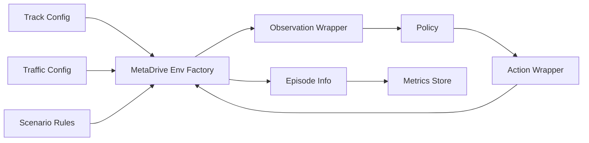

# Simulator and Environment

## 1. MetaDrive Simulator

MetaDrive is a procedural driving simulator designed for autonomous driving and reinforcement learning. For racing use cases, the simulator provides the core ingredients needed to generate diverse closed-loop control tasks:

- road topology generation
- lane geometry and map templates
- traffic actors and scripted vehicles
- kinematic and dynamic vehicle state
- sensor observations
- termination logic for success, collisions, and out-of-road events

In this project, MetaDrive acts as the environment kernel. The RL system layers on top of it by defining racing-specific training rules, multi-agent competition policies, evaluation arenas, and ranking logic.

## 2. Racing Problem Formulation

Each episode is an MDP or partially observable MDP:

\[
\mathcal{M} = \langle \mathcal{S}, \mathcal{O}, \mathcal{A}, P, R, \gamma \rangle
\]

Where:

- \(\mathcal{S}\): latent simulator state including ego pose, velocity, lane context, and other vehicles
- \(\mathcal{O}\): policy observation such as lidar-like features, navigation signals, and ego state
- \(\mathcal{A}\): continuous driving commands, usually steering and throttle or steering and acceleration
- \(P\): transition dynamics induced by the physics engine and traffic actors
- \(R\): reward function
- \(\gamma\): discount factor

For multi-agent racing, the environment becomes a Markov game:

\[
\mathcal{G} = \langle \mathcal{S}, \{\mathcal{A}_i\}_{i=1}^N, P, \{R_i\}_{i=1}^N \rangle
\]

Each policy controls one vehicle and must optimize against a non-stationary set of opponents.

## 3. Environment Architecture

The environment layer should isolate all simulator version drift. In this repository that responsibility sits in [envs.py](/Users/shivamkumar/Desktop/temp/metadrive/src/metadrive_racing_arena/envs.py).

## 4. Observation Design

Driving policies should not consume raw simulator internals directly. They need stable, normalized features:

- ego speed, heading, lateral offset, yaw rate
- lane-relative position
- waypoint or navigation target encoding
- nearby vehicle occupancy or lidar summary
- collision flags
- route completion or progress

Recommended preprocessing:

- flatten nested observation structures into a stable vector
- normalize bounded values to roughly `[-1, 1]`
- clip outlier sensor values
- preserve deterministic feature ordering across simulator versions

If adding transformer policies later, preserve an unflattened tokenizable representation as an alternative path:

- token type `ego`
- token type `lane_marker`
- token type `opponent_vehicle`
- token type `traffic_vehicle`
- token type `waypoint`

## 5. Action Space

Most MetaDrive racing policies use a continuous action vector:

\[
a_t = [\delta_t, \tau_t]
\]

Where:

- \(\delta_t\): steering command
- \(\tau_t\): throttle, acceleration, or longitudinal control

The implementation samples unconstrained Gaussian actions in policy space and then squashes/scales them into the simulator action bounds. This is standard for PPO on continuous control tasks.

## 6. Multi-Agent RL Environment Modes

There are two useful modes:

1. Native multi-agent racing:
   Multiple agents step simultaneously in a shared world.
2. Same-seed sequential evaluation:
   Policies run separately on the same track seed and are compared post hoc.

Native multi-agent mode is the right choice for:

- overtaking behavior
- blocking and defensive driving
- adversarial racing
- self-play

Sequential comparison is weaker behaviorally, but still useful when:

- simulator multi-agent APIs differ between versions
- infrastructure is being bootstrapped
- regression testing must stay deterministic

## 7. Reward Shaping for Autonomous Driving and Racing

The reward must balance racing speed with safe driving:

\[
r_t = w_p r_t^{progress} + w_v r_t^{velocity} + w_c r_t^{comfort} + w_l r_t^{lane} - w_x r_t^{crash} - w_o r_t^{offroad}
\]

Typical components:

- `progress`: route completion delta or arc-length gain
- `velocity`: positive incentive for sustained forward motion
- `lane`: small penalty for unstable lateral drift
- `comfort`: optional penalty for jerky steering or acceleration
- `crash`: large terminal penalty
- `offroad`: large penalty for leaving the track
- `overtake`: optional sparse reward for passing opponents
- `finish_bonus`: large sparse reward for reaching the goal

Reward shaping mistakes are a common failure source:

- too much speed reward creates reckless crashing policies
- too much safety penalty creates slow conservative driving
- too much dense shaping creates policies that optimize proxies instead of winning races

## 8. Trajectory Optimization Perspective

Even with PPO, racing can be understood as approximate trajectory optimization. The policy produces controls that induce a trajectory:

\[
\tau = (s_0, a_0, s_1, a_1, \dots, s_T)
\]

The implicit objective is:

\[
\max_{\pi_\theta} \mathbb{E}_{\tau \sim \pi_\theta} \left[\sum_{t=0}^{T} \gamma^t r_t \right]
\]

This differs from classical model predictive control:

- PPO optimizes a parametric policy offline over many trajectories
- MPC solves a local finite-horizon optimization online at execution time

Hybrid designs are possible:

- PPO policy for tactical decisions
- low-level trajectory tracking controller for stability
- learned value function to rank candidate motion plans

## 9. Curriculum Design for the Simulator

A robust curriculum helps policies learn without collapsing early:

1. Single-agent low-traffic lane following
2. Higher-speed racing without opponents
3. Traffic interaction with non-adversarial actors
4. Two-agent racing on simple tracks
5. Mixed maps, denser traffic, and stronger opponents

Curriculum axes:

- track complexity
- traffic density
- opponent skill
- horizon length
- observation noise
- recovery difficulty after mistakes

