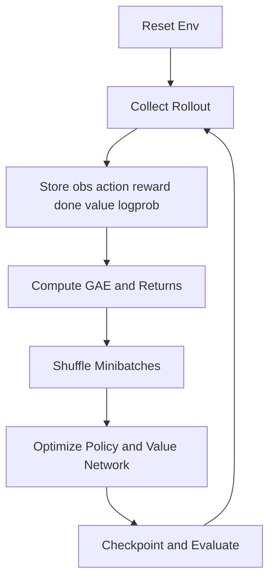
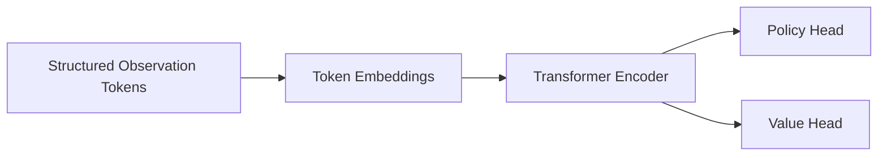

# PPO and Learning Theory

## 1. PPO Training Pipeline

The PPO pipeline in this project follows the standard loop:

Core components:

- actor-critic neural network
- rollout buffer
- generalized advantage estimation
- clipped policy objective
- value regression loss
- entropy regularization
- checkpointing and evaluation

## 2. Policy Gradient Objective

The policy objective is to maximize expected return:

\[
J(\theta) = \mathbb{E}_{\tau \sim \pi_\theta}\left[\sum_{t=0}^{T} \gamma^t r_t \right]
\]

Vanilla policy gradient gives:

\[
\nabla_\theta J(\theta) = \mathbb{E}_{\tau \sim \pi_\theta} \left[\sum_{t=0}^{T} \nabla_\theta \log \pi_\theta(a_t|s_t)\hat{A}_t \right]
\]

Where \(\hat{A}_t\) is an advantage estimate.

## 3. Trust Region Motivation

Direct gradient ascent can change the policy too aggressively and destabilize learning. PPO approximates trust-region control by clipping the importance ratio:

\[
r_t(\theta) = \frac{\pi_\theta(a_t|s_t)}{\pi_{\theta_{old}}(a_t|s_t)}
\]

The clipped surrogate objective is:

\[
L^{clip}(\theta) = \mathbb{E}_t \left[\min\left(r_t(\theta)\hat{A}_t, \text{clip}(r_t(\theta), 1-\epsilon, 1+\epsilon)\hat{A}_t \right)\right]
\]

Interpretation:

- if the new policy improves probability in a direction supported by the advantage, that is good
- if it changes too much, clipping suppresses the gain
- this stabilizes updates without requiring a second-order optimizer

## 4. Value Function Loss

The critic estimates:

\[
V^\pi(s_t) = \mathbb{E}_{\pi}\left[\sum_{l=0}^{T-t}\gamma^l r_{t+l} \mid s_t \right]
\]

The regression objective is usually:

\[
L^{value}(\phi) = \mathbb{E}_t \left[(V_\phi(s_t) - \hat{R}_t)^2\right]
\]

Where \(\hat{R}_t\) is the bootstrapped return target.

## 5. Entropy Bonus

To avoid premature collapse into deterministic low-exploration policies:

\[
L^{entropy}(\theta) = \mathbb{E}_t[\mathcal{H}(\pi_\theta(\cdot|s_t))]
\]

Full loss:

\[
L(\theta, \phi) = -L^{clip}(\theta) + c_v L^{value}(\phi) - c_e L^{entropy}(\theta)
\]

Where:

- \(c_v\): value loss coefficient
- \(c_e\): entropy coefficient

## 6. Generalized Advantage Estimation

GAE reduces variance while keeping tolerable bias:

\[
\delta_t = r_t + \gamma V(s_{t+1}) - V(s_t)
\]

\[
\hat{A}_t^{GAE(\gamma,\lambda)} = \sum_{l=0}^{\infty} (\gamma \lambda)^l \delta_{t+l}
\]

Practical effect:

- lower variance than Monte Carlo returns
- more stable PPO updates
- smoother learning on long-horizon driving tasks

## 7. Replay Buffers

The current PPO implementation uses an on-policy rollout buffer, not an off-policy replay buffer. That distinction matters:

- on-policy rollout buffer:
  Stores trajectories collected with the current policy and is discarded after updates.
- replay buffer:
  Stores experience across many policy versions and is reused later.

Why PPO typically avoids replay:

- importance ratios become stale quickly
- control performance degrades if policy drift is large

Where replay buffers still matter in this ecosystem:

- imitation learning datasets
- offline policy analysis
- hybrid PPO plus auxiliary supervised objectives
- prioritized storage of rare failure cases for diagnostics

## 8. Multi-Agent RL and Self-Play

In self-play, the environment dynamics are non-stationary because the opponent policy changes. This breaks the assumptions of plain single-agent RL.

Common stabilizers:

- opponent pools instead of only latest policy
- frozen checkpoints for several training iterations
- prioritized sampling of opponents near the current skill level
- league training with exploiters and main agents

A simple self-play objective:

\[
\max_{\theta} \mathbb{E}_{o \sim \mathcal{P}_{opp}} \left[ J(\pi_\theta, o) \right]
\]

Where \(\mathcal{P}_{opp}\) is a distribution over historical opponents.

## 9. Imitation Learning

Imitation learning is useful for bootstrapping racing behavior before PPO fine-tuning.

Behavior cloning objective:

\[
\min_{\theta} \mathbb{E}_{(o,a) \sim \mathcal{D}}[-\log \pi_\theta(a|o)]
\]

Data sources:

- scripted expert controllers
- human teleoperation
- MPC-generated trajectories
- top-performing historical policies

A practical recipe:

1. Pretrain with behavior cloning
2. Switch to PPO on the same observation/action interface
3. Add self-play once lane following and cornering are stable

## 10. Transformer Driving Policies

Transformer policies become useful when observations include sets, temporal sequences, or variable numbers of surrounding actors.

Token examples:

- ego token
- waypoint tokens
- nearby vehicle tokens
- race state token

A typical architecture:

Transformer advantages:

- handles variable numbers of nearby entities
- models interaction structure between ego and opponents
- supports longer temporal context

Tradeoffs:

- larger memory footprint
- slower rollout throughput
- more sensitive distributed training costs

## 11. Hyperparameter Tuning

Important PPO hyperparameters for racing:

- rollout length
- minibatch size
- learning rate
- clip coefficient
- entropy coefficient
- value loss coefficient
- network width and depth
- action standard deviation schedule

Search strategies:

- random search for coarse exploration
- Bayesian optimization for expensive settings
- population-based training for distributed runs

Practical tuning order:

1. fix observation and reward definition
2. tune learning rate and rollout length
3. tune entropy and clip range
4. tune architecture size
5. tune self-play and opponent sampling parameters

