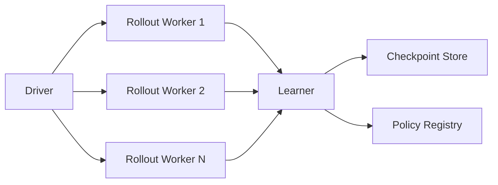
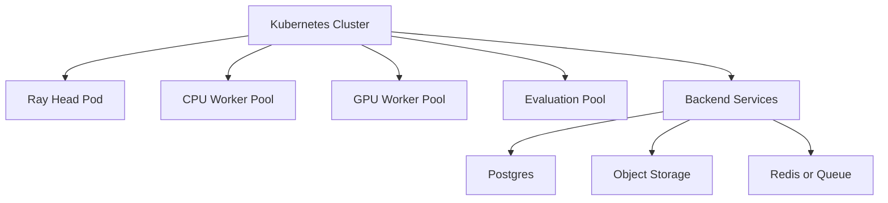

# Distributed Infrastructure

## 1. Distributed Training Goals

Distributed training is needed when:

- simulator stepping dominates wall-clock time
- policy evaluation requires many head-to-head matches
- hyperparameter search runs many experiments in parallel
- transformer policies or larger critics increase compute cost

The system should separate:

- control plane
- rollout plane
- learner plane
- evaluation plane
- storage and metadata plane

## 2. Ray RLlib Distributed Rollout Workers

RLlib is a natural fit when scaling beyond a single process. It provides:

- actor-based rollout workers
- environment vectorization
- centralized learner coordination
- checkpointing and experiment management

High-level RLlib flow:

Worker responsibilities:

- create MetaDrive environments with deterministic seeds
- sample trajectories
- batch observations on CPU
- ship rollout fragments back to the learner

Learner responsibilities:

- aggregate samples
- compute PPO updates on GPU
- publish new weights to workers

## 3. Rollout Worker Orchestration

Worker orchestration needs explicit control over:

- seeds
- environment versions
- policy weights
- opponent assignments
- map schedules
- traffic schedules

A rollout job spec should contain:

- experiment id
- policy version id
- simulator image tag
- track distribution
- opponent selection policy
- max episode horizon
- number of environments per worker

## 4. Kubernetes Cluster Design

For production-scale training, use a Kubernetes deployment with separate node pools:

- CPU node pool for rollout workers
- GPU node pool for learners
- general node pool for APIs, schedulers, and metadata services

Reference layout:

Recommended services:

- `Ray head`: cluster scheduler and job entrypoint
- `Learner deployment`: PPO learner or RLlib trainer
- `Rollout workers`: autoscaled CPU-heavy pods
- `Tournament workers`: evaluation jobs and match execution
- `Leaderboard backend`: API and ranking persistence
- `Object storage`: checkpoints, metrics, replay artifacts
- `Postgres`: policy registry, run metadata, match history

## 5. Infrastructure Setup

Minimum stack:

- container registry for simulator images
- Kubernetes cluster with GPU operator if using NVIDIA GPUs
- object storage such as S3, GCS, or MinIO
- metrics stack such as Prometheus and Grafana
- centralized logging such as Loki, Elasticsearch, or Cloud Logging

Container image should pin:

- Python version
- CUDA version
- PyTorch version
- MetaDrive version
- Ray version
- OS-level simulator dependencies

## 6. GPU Scaling

Learner-side GPU scaling strategies:

- single-GPU PPO for moderate MLP policies
- data parallel PPO for larger batches
- multi-GPU learners for transformer-based policies
- dedicated evaluation GPUs only if rendering or heavy models require it

Throughput bottlenecks usually shift in this order:

1. simulator CPU stepping
2. rollout serialization and transport
3. learner GPU utilization
4. checkpoint I/O and metric write amplification

Key signals to monitor:

- samples per second
- learner update time
- GPU utilization
- policy lag between learner and workers
- environment reset latency

## 7. Policy Registry

The policy registry is the canonical inventory of trainable and evaluable policies.

It should track:

- policy id
- parent policy id
- training config hash
- checkpoint URI
- model architecture
- simulator version
- reward version
- evaluation summary
- registration timestamp

Registry design options:

- Postgres table for metadata
- object store for checkpoint binaries
- content hash or semantic version tag for reproducibility

## 8. Distributed Replay and Artifact Storage

Even if PPO itself is on-policy, artifact storage is still required for:

- imitation learning datasets
- failure-case replay clips
- rollout sample audits
- policy comparison traces

Storage tiers:

- hot metadata in Postgres or Redis
- warm artifacts in object storage
- cold archival in cheaper long-term storage

## 9. Hyperparameter Tuning at Scale

Hyperparameter tuning service should schedule many short training jobs across cluster capacity.

Recommended job metadata:

- trial id
- parameter vector
- seed set
- early-stop state
- best checkpoint URI
- final evaluation summary

Strong practice:

- use multiple seeds for top configurations
- never promote a policy from a single lucky seed
- evaluate on held-out track distributions

## 10. Security and Reliability

Production clusters need:

- image provenance checks
- namespace isolation for experiments
- resource quotas
- checkpoint integrity validation
- explicit timeouts on simulator jobs
- pod anti-affinity for critical services

