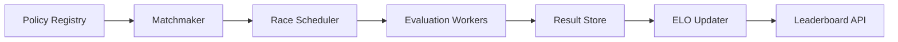

# Evaluation Competition and Leaderboards

## 1. Evaluation Arenas

An evaluation arena is a fixed protocol for measuring policy quality. It should be stricter than the training environment.

Arena dimensions:

- track set
- traffic density distribution
- opponent pool
- weather or observation noise if supported
- seed schedule
- race horizon
- number of repeats

Held-out arenas matter because racing agents overfit aggressively to:

- one map template
- one reward version
- one opponent style
- one traffic mode

## 2. Policy Evaluation

Evaluation should produce both scalar KPIs and race-level traces.

Core metrics:

- mean episodic reward
- success or finish rate
- crash rate
- off-road rate
- average lap time
- route completion
- win rate
- head-to-head ELO delta
- overtakes per race
- control smoothness

A balanced scorecard should separate:

- training reward
- driving quality
- competitive racing outcome

These do not always align.

## 3. Matchmaking Systems

Naive full round robin becomes too expensive as the number of policies grows. Matchmaking should prioritize informative comparisons.

Options:

- round robin for small policy sets
- Swiss-style pairing
- ELO-nearest-neighbor pairing
- uncertainty-aware pairing
- league-based matchmaking

For self-play training, a robust opponent sampler often uses:

\[
p(o_i) \propto \exp\left(-\frac{|R_{current} - R_i|}{\tau}\right)
\]

Where:

- \(R_{current}\): current policy rating
- \(R_i\): opponent rating
- \(\tau\): temperature controlling how narrow the sampling band is

This keeps matches informative and avoids wasting compute on obvious mismatches.

## 4. ELO System

ELO models the expected outcome between two policies:

\[
E_A = \frac{1}{1 + 10^{(R_B - R_A)/400}}
\]

\[
R'_A = R_A + K(S_A - E_A)
\]

Where:

- \(R_A, R_B\): current ratings
- \(E_A\): expected score for policy A
- \(S_A \in \{0, 0.5, 1\}\): observed outcome
- \(K\): update factor

Interpretation:

- beating a stronger opponent yields a larger gain
- losing to a weaker opponent yields a larger penalty
- draws can be meaningful when both policies finish similarly

Limitations:

- ELO assumes transitive skill, which may fail in cyclical strategy matchups
- racing performance can be highly map dependent
- ratings react slowly if `K` is too low and become noisy if `K` is too high

Alternatives:

- Glicko or Glicko-2
- TrueSkill
- map-conditional ELO

## 5. Leaderboard Backend

The leaderboard backend should not just be a static file. A proper service layer should expose:

- policy metadata lookup
- latest ratings
- historical rating curves
- filtered views by map or ruleset
- match result audit trails
- policy registration and promotion APIs

Suggested data model:

- `policies`
- `policy_versions`
- `matches`
- `match_participants`
- `rating_history`
- `evaluation_runs`

Backend responsibilities:

- ingest match results
- recompute aggregates
- expose CSV and JSON exports
- maintain policy aliases and parent-child lineage

## 6. Tournament Manager Design

Scheduler inputs:

- candidate policy set
- arena id
- races per pair
- repeat seeds
- concurrency limit

Outputs:

- race result records
- aggregated metrics
- updated ratings

## 7. Evaluation Metrics in Detail

Useful metric categories:

1. Outcome metrics:
   win rate, podium rate, finish rate
2. Safety metrics:
   crash rate, out-of-road rate, contact count
3. Efficiency metrics:
   lap time, progress per second, control effort
4. Stability metrics:
   variance across seeds, variance across tracks
5. Generalization metrics:
   held-out arena score, unseen opponent score

Recommended reporting:

- mean
- standard deviation
- confidence interval across seeds
- percentile tails for failures

## 8. Adversarial Racing Evaluation

Adversarial racing exposes strategic weakness:

- policies that win only in open track conditions
- policies that fail under pressure from nearby opponents
- policies that exploit fragile reward shaping

Adversarial test modes:

- aggressive blocker opponent
- faster opponent starting behind ego
- forced narrow passing zones
- denser traffic with competitive opponents

## 9. Promotion Rules

Policies should not enter the main leaderboard automatically after training.

A promotion gate should require:

- minimum finish rate
- acceptable crash threshold
- evaluation on held-out maps
- sufficient number of head-to-head races

This keeps the registry from filling with low-quality checkpoints that distort matchmaking.

